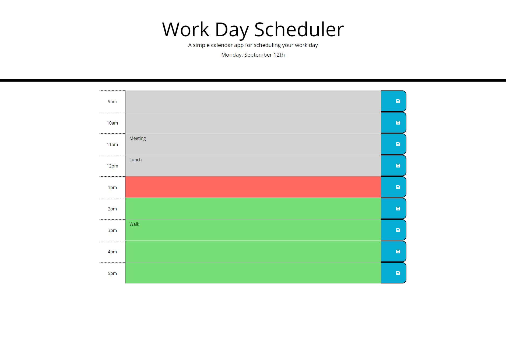

# Work Day Scheduler

## Description

This is a work day scheduler project for the UW Coding Bootcamp.  This page uses HTML, CSS, Javascript, and APIs to create a functioning schedule.

## Installation
Use a web browser to access the site:

https://andreahergert.github.io/work_day_scheduler/

## Usage
The user will be presented with today's date and time blocks for each hour of the work day.  Time that has passed is in grey, present time in red, and future time in green.  The user can type in the description box in the middle column for what their planned scheduled event is for that hour.  Once the user types their event, they can press the save button on the right and even if the user refreshes that page, their event will still show up on the page.

Screenshot of website:

## License
MIT License